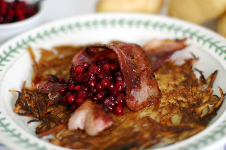

# Rårakor med fläsk

### Ingredienser
- Potatis
- Lök
- Rödkål
- Äpple
- Stekfläsk eller bacon
- Creme fraiche
- Lingonsylt eller rårörda lingon
### Tänk på
- Gör rårakorna tunna
- Använd relativ hög värme
